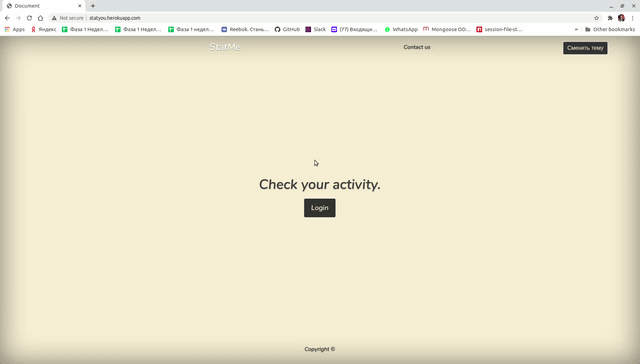
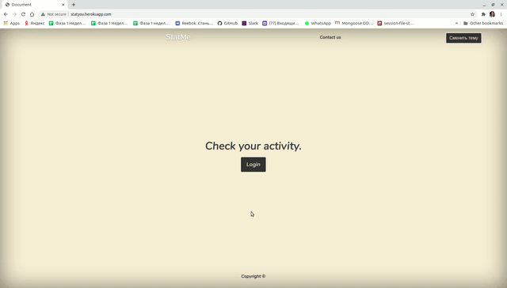
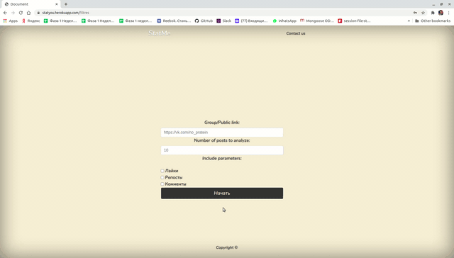

Приложение для составление рейтинга самых активных пользователей определенной группы ВК по лайкам, комментариям и репостам;

### Выбор темы:
Перед началом работы можно выбрать тему приложения (светлую или темную)

### Аутентификация:
Перед началом пользования приложением необходимо аутентифицироваться через VKontakte прямо внутри приложения.

### Начало работы:
Далее необходимо вставить в поле ввода "Group/Public link"
адрес интересующей группы, выбрать количество постов, которое надо проанализировать и тип записей, по которым необходимо произвести поиск (лайк, комментарий, репост).

В самом верху списка располагается наиболее активный участник группы, нажав на его ID можно перейти на его страницу.

Ссылка на приложение: http://statyou.herokuapp.com/

Состав команды:

-[Иван Каштанов](https://github.com/kashtn)

-[Денис Эпштейн](https://github.com/DenisEps)

-[Егор Богданов](https://github.com/YegorBogdanov)
